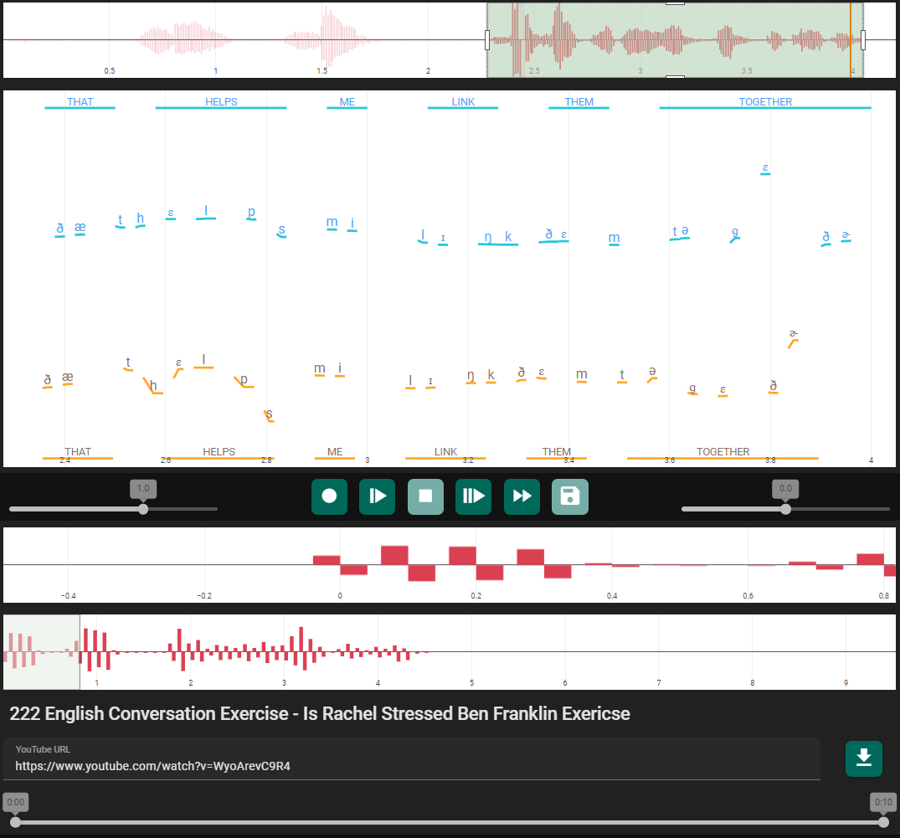
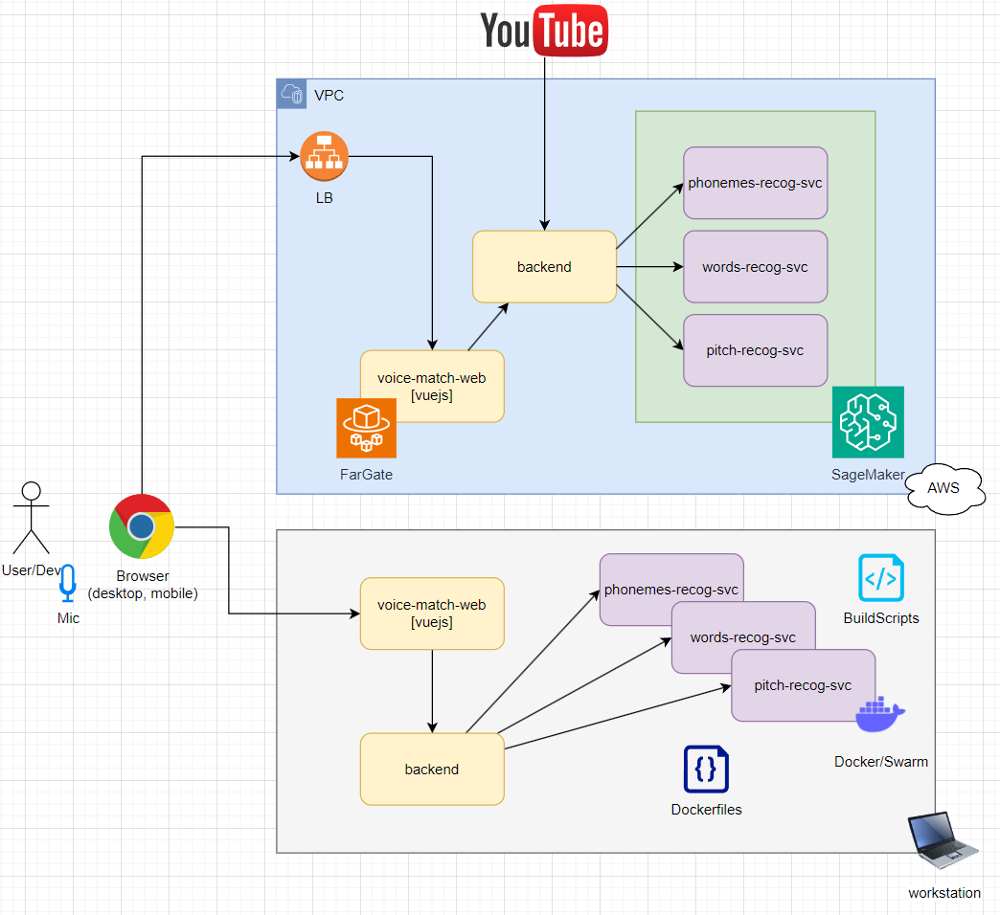

# VoiceMatch: AI-Powered English Pronunciation Practice Platform

## Table of Contents
1. [Project Overview](#project-overview)
2. [Key Features](#key-features)
3. [System Architecture](#system-architecture)
4. [Component Setup](#component-setup)

## Project Overview
VoiceMatch is a full-stack, cloud-native application designed to help users improve their English pronunciation through advanced speech analysis and interactive visual feedback. The platform leverages state-of-the-art machine learning models (PyTorch, TensorFlow) to break down user speech into phonemes, evaluate pitch, and compare pronunciation against native speakers. The system features scalable backend APIs, a modern Vue.js frontend, and robust cloud video processing pipelines (AWS S3, Docker). Users receive actionable, data-driven insights and real-time visualizations to guide their learning journey.

Below are screenshots from the demo, showcasing phoneme-level analysis, pitch visualization, and interactive playback controls that help users practice and refine their pronunciation:



*Example: Visual feedback and phoneme breakdown for an English conversation exercise.*

## Key Features
- End-to-end speech analysis with phoneme and pitch detection
- Real-time comparison with native speaker benchmarks
- Interactive web interface for detailed feedback and playback
- Scalable backend and cloud infrastructure for video and audio processing
- Modular architecture: Web frontend, backend API, ML model serving
- Technologies: Python, TypeScript, Vue.js, AWS S3, Docker, PyTorch, TensorFlow


## System Architecture
The application consists of three main components:
1. **VoiceMatch Web** – Frontend application for English pronunciation practice.
2. **VoiceMatch Backend** – Backend application for managing user data and providing API for the frontend.
3. **VoiceMatch Models** – Machine learning models for speech analysis.

Below is the system architecture diagram, illustrating the data flow between the user, frontend, backend, and machine learning services:

1. User records a video with their pronunciation in the frontend application.
2. The video is uploaded to the S3 bucket and duplicated locally (for a local cache).
3. Backend application receives the message from the frontend and sends the video to the machine learning models for speech analysis.
4. Three machine learning models in parallel analyze the speech and return the results to the backend application.
5. The backend application sends the results to the frontend application for visualization.
6. User analyzes results on the visual chart and practices their pronunciation.



## Component Setup

### Download & Preprocessing
```sh
cd /root/ws/ml/dwl

sudo curl -L https://yt-dl.org/downloads/latest/youtube-dl -o /usr/local/bin/youtube-dl
sudo chmod a+rx /usr/local/bin/youtube-dl

youtube-dl --version
youtube-dl --help

# youtube-dl --verbose "https://www.youtube.com/watch?v=kvher7AlvrY"
youtube-dl --verbose --get-filename -o 'rachel-ben-franklin.%(ext)s' "https://www.youtube.com/watch?v=kvher7AlvrY"
youtube-dl --verbose -o rachel-movie.mp4 "https://www.youtube.com/watch?v=wuLIUtrSE-g&ab_channel=Rachel%27sEnglish"

youtube-dl --verbose -f 'bestvideo[ext=mp4]+bestaudio[ext=m4a]/best[ext=mp4]/best' \
  -o "rachel-ben-franklin.mp4" "https://www.youtube.com/watch?v=niPHrqdmgrA"

youtube-dl --verbose -o "rachel-last-night-working-here.mp4" "https://www.youtube.com/watch?v=q7SAt9h4sd0"

youtube-dl --verbose -o "hadar-intonation" "https://www.youtube.com/watch?v=FStyKn4V8cE"
ffmpeg -i hadar-intonation.mkv -codec copy hadar-intonation.mp4

youtube-dl --verbose -o "anna-fast-speech" "https://www.youtube.com/watch?v=ppRAiKPsdnQ&t=500s"
ffmpeg -i anna-fast-speech.mkv -codec copy anna-fast-speech.mp4
ffmpeg -i anna-fast-speech.mkv -c:v prores_ks -profile:v 3 -c:a pcm_s24le anna-fast-speech.mov

```

### Frontend (VoiceMatch Web)
```sh
# cd /root/ws/ml/web
# npm init vue@latest

cd /root/ws/ml/web/vue-project
# npm i
npm run format
npm run dev

npm i -g @vue/cli
vue --version
npm i --save-dev @vue/cli-service
vue-cli-service --version

# install dependencies
npm i everpolate
npm i tone
npm i -D @vitejs/plugin-basic-ssl

```

### Research & Model Training
```sh
cd /root/ws/ml/voicematch
# conda create --name pytorch-tf
conda activate pytorch-tf
which python && python --version
# conda deactivate

python -c "import torch; print(torch.cuda.is_available())"
python -c "import tensorflow; print(tensorflow.config.list_physical_devices('GPU'))"
# python -c "import tensorrt; print(tensorrt.__version__); assert tensorrt.Builder(tensorrt.Logger())"

python voicematch.py

```

### Deep Learning Containers
* https://github.com/aws/deep-learning-containers/blob/master/available_images.md
```sh
cd /root/ws/ml/dlc
# conda create --name dlc
conda activate dlc
python --version
which python

unset AWS_PROFILE
export AWS_PROFILE=iliazlobin-gpt
aws sts get-caller-identity
# aws iam list-roles
aws iam get-role --role-name "sagemaker-local-role"
aws s3 ls s3://sagemaker-us-east-1-908060038426/model/pytorch/model.tar.gz
aws s3 ls s3://hf-sagemaker-inference/model.tar.gz
aws s3 cp s3://sagemaker-us-east-1-908060038426/model/pytorch/model.tar.gz model.tar.gz
rm model.tar.gz

pip install sagemaker
pip install 'sagemaker[local]'
pip install boto3 sagemaker pandas matplotlib torch torchvision

# local inference
python deploy.py

docker container ls
docker exec -it 1fae50381992 bash

# aws s3 cp /root/ws/ml/dlc/model.tar.gz s3://sagemaker-us-east-1-908060038426/model.tar.gz

cd /root/ws/ml/dlc
tar cvfz model.tar.gz -C model/ .
python deploy.py

python predict.py

```

### Model Serving
```sh
docker container ls
docker stats --all

docker stop $(docker ps -q --filter ancestor=voicematch-wordrecog:latest --format="{{.ID}}")
docker run --rm -d --name voicematch-wordrecog --memory=32g --memory-swap=32g -p 7081:8080 voicematch-wordrecog:latest serve
curl -v -H "Content-Type:application/octet-stream" -T /home/izlobin/ws/voicematch-labs/voicematch-models/data/hello-hello.ogg http://localhost:7081/predictions/model
curl -v -H "Content-Type:application/octet-stream" -T /home/izlobin/ws/voicematch-labs/voicematch-backend/dwl/youtube/horMQDOeqZ0-4_5.ogg http://localhost:7081/predictions/model # 2 min, worker dies

docker stats $(docker ps -q --filter ancestor=voicematch-wordrecog:latest --format="{{.ID}}")
docker logs $(docker ps -q --filter ancestor=voicematch-wordrecog:latest --format="{{.ID}}")

docker stop $(docker ps -q --filter ancestor=voicematch-phonerecog:latest --format="{{.ID}}")
docker run --rm -d --name voicematch-phonerecog --memory=32g --memory-swap=32g -p 7082:8080 voicematch-phonerecog:latest serve
curl -v -H "Content-Type:application/octet-stream" -T /home/izlobin/ws/voicematch-labs/voicematch-models/data/hello-hello.ogg http://localhost:7082/predictions/model
curl -v -H "Content-Type:application/octet-stream" -T /home/izlobin/ws/voicematch-labs/voicematch-backend/dwl/youtube/horMQDOeqZ0-4_5.ogg http://localhost:7082/predictions/model # 2 min, worker dies

docker stats $(docker ps -q --filter ancestor=voicematch-phonerecog:latest --format="{{.ID}}")
docker logs $(docker ps -q --filter ancestor=voicematch-phonerecog:latest --format="{{.ID}}")

docker stop $(docker ps -q --filter ancestor=voicematch-pitcheval:latest --format="{{.ID}}")
docker run --rm -d --name voicematch-pitcheval --memory=8g -p 7083:8080 \
   -v "/home/izlobin/ws/voicematch-labs/voicematch-models/models/pitcheval/model:/opt/ml/model/1" \
   -v "/home/izlobin/ws/voicematch-labs/voicematch-models/models/pitcheval/model/code:/opt/ml/model/code" \
   -v "/home/izlobin/ws/voicematch-labs/github/sagemaker-tensorflow-serving-container/docker/build_artifacts/sagemaker:/sagemaker" \
   -e TF_CPP_MIN_VLOG_LEVEL=2 \
   -e SAGEMAKER_GUNICORN_LOGLEVEL="debug" \
  voicematch-pitcheval:latest serve
curl -v -X POST -H "Content-Type:application/octet-stream" -T /home/izlobin/ws/voicematch-labs/voicematch-models/data/hello-hello.ogg http://localhost:7083/invocations
curl -v -X POST -H "Content-Type:application/octet-stream" -T /home/izlobin/ws/voicematch-labs/voicematch-backend/dwl/youtube/horMQDOeqZ0-4_5.ogg http://localhost:7083/invocations # 2 min, worker dies

docker stats $(docker ps -q --filter ancestor=voicematch-pitcheval:latest --format="{{.ID}}")
docker logs $(docker ps -q --filter ancestor=voicematch-pitcheval:latest --format="{{.ID}}")

# web
cd /home/izlobin/ws/voicematch-labs/voicematch-web
npm run dev

# backend
cd /home/izlobin/ws/voicematch-labs/voicematch-backend
sls offline --noPrependStageInUrl

```

### Model Build & Deployment
```sh
cd /root/ws/ml/dlc

unset AWS_PROFILE
export AWS_PROFILE=iliazlobin-gpt
aws sts get-caller-identity

# docker pull 908060038426.dkr.ecr.us-east-1.amazonaws.com/amazonlinux:latest
aws ecr get-login-password --region us-east-1 | docker login --username AWS --password-stdin 908060038426.dkr.ecr.us-east-1.amazonaws.com

aws ecr get-login-password --region us-west-2 | docker login --username AWS --password-stdin 763104351884.dkr.ecr.us-west-2.amazonaws.com
docker pull 763104351884.dkr.ecr.us-west-2.amazonaws.com/djl-inference:0.21.0-deepspeed0.8.0-cu117

# docker-compose -f "/home/izlobin/ws/voicematch-labs/voicematch-models/docker-compose.yaml" up --build --abort-on-container-exit

# cd /home/izlobin/ws/voicematch-labs/voicematch-models/docker-huggingface
# docker build -t voicematch:huggingface .

# rm containers
docker container ls
docker rm $(docker stop $(docker ps -aq --filter ancestor=voicematch-wordrecog:latest --format="{{.ID}}"))

# build wordrecog model
cd /home/izlobin/ws/voicematch-labs/voicematch-models/models/wordrecog
docker build -t voicematch-wordrecog:latest .

# build phonerecog model
cd /home/izlobin/ws/voicematch-labs/voicematch-models/models/phonerecog
docker build -t voicematch-phonerecog:latest .

```

### Backend (VoiceMatch Backend)
```sh
cd /home/izlobin/ws/voicematch-labs/voicematch-backend

npm i serverless@3.28.1
npm i @vendia/serverless-express

npm i compression
npm i @types/compression
npm i cors
npm i @types/cors
# eslint
npm i eslint
npm i eslint-plugin-jest
# libs
# npm r youtube-dl
# npm r -D @types/youtube-dl

npm i youtube-dl-exec --save
# npm i -D @types/youtube-dl-exec

npm i @aws-sdk/client-s3

npm i "dotenv"
npm i -D "@types/dotenv"

# types
npm i -D typescript@5.0.2
npm i -D @types/node
npm i -D serverless-plugin-typescript
npm i -D @types/aws-lambda

npm i -D tsconfig-paths
npm i -D ts-node

npm r webpack
npm i fork-ts-checker-webpack-plugin@8.0.0

npm install @types/file-saver --save-dev

sls -version
sls plugin install -s "dev" --name "serverless-bundle"
sls plugin install -s "dev" --name "serverless-offline"
sls plugin install -s "dev" --name "serverless-plugin-typescript"
sls plugin install -s "dev" --name "serverless-dotenv-plugin"
sls plugin install -s "dev" --name "serverless-plugin-lambda-insights"

# build
mkdir -p /home/izlobin/ws/voicematch-labs/voicematch-backend/.webpack/service/src/bin/
cp /home/izlobin/ws/voicematch-labs/voicematch-backend/node_modules/youtube-dl/bin/youtube-dl /home/izlobin/ws/voicematch-labs/voicematch-backend/.webpack/service/src/bin/
cp /home/izlobin/ws/voicematch-labs/voicematch-backend/node_modules/youtube-dl/bin/youtube-dl /home/izlobin/ws/voicematch-labs/voicematch-backend/ydl
/home/izlobin/ws/voicematch-labs/voicematch-backend/.webpack/service/src/bin/youtube-dl --version

# debug
export SLS_DEBUG="*"

sls offline --help
cd /home/izlobin/ws/voicematch-labs/voicematch-backend
sls offline --noPrependStageInUrl

node --inspect node_modules/serverless/bin/serverless.js offline --noPrependStageInUrl -s dev
node -r tsconfig-paths/register -r ts-node/register --inspect node_modules/serverless/bin/serverless.js offline --noPrependStageInUrl -s dev
ts-node -r tsconfig-paths/register -r ts-node/register node_modules/serverless/bin/serverless.js offline --noPrependStageInUrl -s dev

# test
read -d '' -r json <<JSON
{
  "type": "account"
}
JSON
echo $json | jq

# test backend
curl -v -X GET -H "Content-Type:application/json" -d "$json" http://localhost:3000/youtube/info?videoHash=WyoArevC9R4
curl -v -X GET -H "Content-Type:application/json" -d "$json" http://localhost:3000/youtube/info?videoHash=52cOdRE97Kk
# curl -v -X GET -H "Content-Type:application/json" -d "$json" http://localhost:3000/youtube/download?v=WyoArevC9R4

# youtube-dl
sudo curl -L https://github.com/yt-dlp/yt-dlp/releases/latest/download/yt-dlp -o /usr/local/bin/youtube-dl
sudo chmod a+rx /usr/local/bin/youtube-dl
youtube-dl --version

cd /home/izlobin/ws/voicematch-labs/voicematch-backend

/usr/local/bin/youtube-dl https://www.youtube.com/watch?v=GC8sVqk1J8c --output dwl/GC8sVqk1J8c.wav --extract-audio --audio-format wav
/usr/local/bin/youtube-dl https://www.youtube.com/watch?v=GC8sVqk1J8c --output dwl/GC8sVqk1J8c-opus.ogg --extract-audio --audio-format opus
/usr/local/bin/youtube-dl https://www.youtube.com/watch?v=GC8sVqk1J8c --output dwl/GC8sVqk1J8c-vorbis.ogg --extract-audio --audio-format vorbis

/usr/local/bin/youtube-dl https://www.youtube.com/watch?v=52cOdRE97Kk --output dwl/52cOdRE97Kk.wav --extract-audio --audio-format wav
/usr/local/bin/youtube-dl https://www.youtube.com/watch?v=52cOdRE97Kk --output dwl/52cOdRE97Kk-opus.ogg --extract-audio --audio-format opus
/usr/local/bin/youtube-dl https://www.youtube.com/watch?v=52cOdRE97Kk --output dwl/52cOdRE97Kk-vorbis.ogg --extract-audio --audio-format vorbis

/usr/local/bin/youtube-dl https://www.youtube.com/watch?v=52cOdRE97Kk --help
/usr/local/bin/youtube-dl https://www.youtube.com/watch?v=52cOdRE97Kk --write-info-json --skip-download
/usr/local/bin/youtube-dl https://www.youtube.com/watch?v=52cOdRE97Kk --get-duration --skip-download
/usr/local/bin/youtube-dl https://www.youtube.com/watch?v=52cOdRE97Kk --print-json -s --skip-download
/usr/local/bin/youtube-dl https://www.youtube.com/watch?v=52cOdRE97Kk --print-json -s -q --skip-download
/usr/local/bin/youtube-dl https://www.youtube.com/watch?v=52cOdRE97Kk -s --get-duration -e

# debug
cd /home/izlobin/ws/voicematch-labs/voicematch-backend
youtube-dl https://www.youtube.com/watch?v=1L-3AeSf428 --output dwl/youtube/1L-3AeSf428.ogg --extract-audio --audio-format vorbis

# s3 cli client
export AWS_PROFILE=iliazlobin-gpt

aws s3 cp dwl/GC8sVqk1J8c.wav s3://voicematch-downloads/youtube/GC8sVqk1J8c.wav

ffmpeg -i dwl/GC8sVqk1J8c.wav -acodec libvorbis dwl/GC8sVqk1J8c.ogg

```

### FFmpeg Utilities
```sh
cd /home/izlobin/ws/voicematch-labs/voicematch-backend

ffmpeg -encoders | grep libvorbis
ffmpeg -decoders | grep libvorbis

ls "dwl/youtube/WyoArevC9R4-copy.ogg"

ffmpeg -i anna-fast-speech.mkv -c:v prores_ks -profile:v 3 -c:a pcm_s24le anna-fast-speech.mov

ffmpeg -i "dwl/youtube/WyoArevC9R4-copy.ogg" -acodec libavcodec -ss 1 -t 2 -y -c copy "dwl/youtube/WyoArevC9R4-cut.ogg"
ffmpeg -i "dwl/youtube/WyoArevC9R4-copy.ogg" -acodec libavcodec -ss 1 -t 2 -y -c copy "dwl/youtube/WyoArevC9R4-cut.ogg"

/usr/local/bin/youtube-dl --verbose https://www.youtube.com/watch?v=WyoArevC9R4 --output dwl/test/WyoArevC9R4.ogg --extract-audio --audio-format vorbis
ffmpeg -y -loglevel repeat+info -i file:dwl/test/WyoArevC9R4.ogg -c copy -f mp4 file:dwl/test/WyoArevC9R4.temp.ogg

ffmpeg -y -loglevel repeat+info -i file:dwl/test/WyoArevC9R4.ogg -c copy -y -ss 1 -t 2 -f mp4 file:dwl/test/WyoArevC9R4.out.ogg
ffprobe file:dwl/test/WyoArevC9R4.ogg
ffprobe file:dwl/test/WyoArevC9R4.out.ogg
ffprobe file:dwl/youtube/horMQDOeqZ0-4_6.ogg

ffprobe /home/izlobin/ws/voicematch-labs/voicematch-backend/dwl/hello-hello.ogg
ffprobe /home/izlobin/ws/voicematch-labs/voicematch-backend/dwl/youtube/horMQDOeqZ0-4_5.ogg

ffmpeg -ss 240000 -i dwl/youtube/horMQDOeqZ0.ogg -y -t 120000 -f mp4 dwl/youtube/horMQDOeqZ0-4_6.ogg

npm i --save fluent-ffmpeg
npm i --save @types/fluent-ffmpeg


```


### Quicktype Code Generation
```sh
cd /home/izlobin/ws/voicematch-labs/voicematch-backend

npm i -g quicktype

quicktype S3PutEvent.json -o S3PutEvent.ts


```


### DJL Serving
* https://github.com/deepjavalibrary/djl-serving/blob/master/serving/docs
```sh
curl -X GET "http://localhost:9081/models"
curl -X DELETE "http://localhost:9081/models/voicematch"
# curl -X POST "http://localhost:9081/models?url=file%3A%2F%2F%2Fopt%2Fml%2Fmodel%2Fmodel.tar.gz&engine=PyTorch"
# curl -X POST "http://localhost:9081/models?url=file%3A%2F%2F%2Fopt%2Fml%2Fmodel%2Fmodel-v3a.tar.gz&engine=PyTorch"
# curl -X POST "http://localhost:9081/models?url=file%3A%2F%2F%2Fopt%2Fml%2Fmodel%2Fmodel-v3b.tar.gz&engine=PyTorch&model_name=pytorch_model"
# curl -X POST "http://localhost:9081/models?url=file%3A%2F%2F%2Fopt%2Fml%2Fmodel%2Fvoicematch.tar.gz&engine=PyTorch&model_name=voicematch&model_version=v1"
# curl -v -X POST "http://localhost:9081/workflows?url=https%3A%2F%2Fresources.djl.ai%2Ftest-workflows%2Fmlp.tar.gz"

```

### Multi-Model Server
* https://github.com/awslabs/multi-model-server/tree/master/
```sh
conda create --name mms python
conda activate mms
conda deactivate
conda remove --name mms --all
ls -la /root/miniconda3/envs/mms
which pip && pip --version
which python && python --version
which java && java -version

conda env list

conda list | grep java
conda list | grep openjdk
conda search java
conda search openjdk
conda install openjdk=8.0.152
which java && java -version &&

pip install mxnet-mkl
pip install mxnet-cu92mkl
pip install multi-model-server
which multi-model-server && multi-model-server --help

multi-model-server --foreground --start --models squeezenet=https://s3.amazonaws.com/model-server/model_archive_1.0/squeezenet_v1.1.mar
# multi-model-server --stop

mkdir -p /root/ws/ml/dwl/mar && cd /root/ws/ml/dwl/mar
curl -o /root/ws/ml/dwl/mar/squeezenet_v1.1.mar -O https://s3.amazonaws.com/model-server/model_archive_1.0/squeezenet_v1.1.mar
unzip squeezenet_v1.1.mar

# inference
curl -o /root/ws/ml/dwl/kitten.jpg -O https://s3.amazonaws.com/model-server/inputs/kitten.jpg
nmap -Pn -p 8080 localhost
curl -X POST http://127.0.0.1:8080/predictions/squeezenet -T /root/ws/ml/dwl/kitten.jpg

# cuda 9.2

conda install pytorch torchvision torchaudio pytorch-cuda=11.7 -c pytorch -c nvidia

conda install -y ipykernel
conda install -y pytorch torchvision torchaudio pytorch-cuda=11.7 -c pytorch -c nvidia
conda list | grep pytorch-cuda
conda search pytorch-cuda -c pytorch -c nvidia

conda remove pytorch-cuda=11.7

# conda install cuda92 -c pytorch -c nvidia
# conda remove cuda92


# missing libcudart.so.11.0
# ls /etc/ld.so.conf.d
conda install -c conda-forge cudatoolkit=9.2.148
find $CONDA_PREFIX -name libcudart.so.9.2
ldconfig -p | grep libcudart.so.9.2
ldconfig -p | grep libcudart
export LD_LIBRARY_PATH=/root/miniconda3/envs/ml/lib/:$LD_LIBRARY_PATH

# ldconfig -p | grep libcudart.so.11.0
# # ldconfig -p | grep libssl.so.1.0.0
# ldconfig -p | grep conda
# ldconfig -p | grep libcublas

# cd /root/ws/ml/dwl
# sudo apt-get update && sudo apt-get install wget -y --no-install-recommends
# CUDA_URL="https://developer.nvidia.com/compute/cuda/9.2/Prod2/local_installers/cuda-repo-ubuntu1604-9-2-local_9.2.148-1_amd64"
# wget -c ${CUDA_URL} -O cuda.deb
# sudo dpkg --install cuda.deb
# sudo apt-key add /var/cuda-repo-9-2-local/7fa2af80.pub
# sudo apt-get update
# sudo apt-get install -y cuda
# apt list --installed | grep cuda
# rm cuda.deb

```

### LangChain Environment
```sh
cd /root/ws/ml/langchain-research
# conda create --name langchain
conda activate langchain
python --version
# conda deactivate

conda install langchain -c conda-forge
pip install openai
pip install chromadb
pip install tiktoken

# apify
npm -v
npm -g install apify-cli
# npm -g uninstall apify-cli
apify create my-python-actor -t python-playwright

# playwright
pip install playwright
pip install pytest-playwright
playwright --version
playwright install --with-deps
playwright install

# pip
pip-versions list playwright
pip-versions list apify

pip uninstall apify
pip install apify==1.0.0
apify --version

cd my-typescript-actor
export APIFY_limit=50
apify run

# docker
docker run --rm -it --entrypoint /bin/bash -it my-typescript-actor:latest

npm set progress=false always-auth=false
npm install --omit=dev --omit=optional
echo "Installed NPM packages:"
(npm list --omit=dev --all || true)
echo "Node.js version:"
node --version
echo "NPM version:"
npm --version
rm -r ~/.npm


```

### PyTorch-TensorFlow Environment
```sh
cd /root/ws/ml
# conda create --name pytorch-tf
conda activate pytorch-tf
python --version
# conda deactivate

conda install pytorch torchvision torchaudio pytorch-cuda=11.7 -c pytorch -c nvidia

# pip install torch torchvision torchaudio
python -c "import torch; print(torch. __version__)"
python -c "import torch; print(torch. __file__)"
python -c "import torch; print(torch.backends.cudnn.enabled)"
python -c "import torch; print(torch.cuda.is_available())"
python -c "import torch; print(torch.version.cuda)"

pip install tensorflow tensorflow_hub
python -c "import tensorflow; print(tensorflow. __version__)"

# conda search -c conda-forge tensorflow-gpu
# conda install -c conda-forge tensorflow-gpu
python -c "import tensorflow; print(tensorflow.config.list_physical_devices('GPU'))"

# conda search -c conda-forge cudatoolkit
# conda install -c conda-forge cudatoolkit
# conda install -c conda-forge cudatoolkit=11.7.0

# pip install --upgrade setuptools pip
# pip install nvidia-pyindex

# pip index versions nvidia-tensorrt
pip install nvidia-tensorrt
pip install nvidia-tensorrt==7.2.3.4
# export LD_LIBRARY_PATH=/root/miniconda3/envs/pytorch-tf/lib/python3.8/site-packages/tensorrt/:$LD_LIBRARY_PATH
python -c "import tensorrt; print(tensorrt.__version__); assert tensorrt.Builder(tensorrt.Logger())"

# conda install transformers
pip install transformers gradio datasets chardet cchardet librosa ipython sentencepiece plotly phonemizer


mkdir -p "/root/miniconda3/envs/pytorch-tf/etc/conda/activate.d/"
: > "/root/miniconda3/envs/pytorch-tf/etc/conda/activate.d/env_vars.sh"
echo "export OLD_LD_LIBRARY_PATH=${LD_LIBRARY_PATH}" >> "/root/miniconda3/envs/pytorch-tf/etc/conda/activate.d/env_vars.sh"
echo "export LD_LIBRARY_PATH=/root/miniconda3/envs/pytorch-py38/lib/python3.8/site-packages/tensorrt/:${LD_LIBRARY_PATH}" >> "/root/miniconda3/envs/pytorch-tf/etc/conda/activate.d/env_vars.sh"

mkdir -p "/root/miniconda3/envs/pytorch-tf/etc/conda/deactivate.d/"
: > "/root/miniconda3/envs/pytorch-tf/etc/conda/deactivate.d/env_vars.sh"
echo "export LD_LIBRARY_PATH=${OLD_LD_LIBRARY_PATH}" >> "/root/miniconda3/envs/pytorch-tf/etc/conda/deactivate.d/env_vars.sh"
echo "unset OLD_LD_LIBRARY_PATH" >> "/root/miniconda3/envs/pytorch-tf/etc/conda/deactivate.d/env_vars.sh"

# unset LD_LIBRARY_PATH
# export LD_LIBRARY_PATH=/root/miniconda3/envs/pytorch-py38/lib/python3.8/site-packages/tensorrt/:$LD_LIBRARY_PATH

# unset CUDA_VISIBLE_DEVICES
# export CUDA_VISIBLE_DEVICES=0

pip install transformers gradio datasets chardet cchardet librosa ipython music21 sentencepiece plotly phonemizer

conda install ffprobe

# sagemaker
pip install "sagemaker>=2.48.0" --upgrade

pip install fsspec s3fs

pip show traitlets
pip uninstall traitlets
pip install pip-versions
pip-versions list traitlets

```

### Manual Conda Environment Setup
```sh
mkdir -p ~/ws/ml
cd ~/ws/ml

conda create --name ml python
conda activate ml
# conda deactivate

conda install -y ipykernel
conda install -y pytorch torchvision torchaudio pytorch-cuda=11.7 -c pytorch -c nvidia
conda list

pip install torch

python --version
nvidia-smi
nvcc -V

python -c "import torch; print(torch.backends.cudnn.enabled)"
python -c "import torch; print(torch.cuda.is_available())"
python -c "import torch; print(torch. __version__)"
python -m torch.utils.collect_env

conda install -y transformers chardet
python -c "import transformers; print(transformers. __version__)"
python -c "import sagemaker; print(sagemaker. __version__)"
python --version

pip install gradio
python -c "import gradio; print(gradio. __version__)"

pip install librosa
python -c "import librosa; print(librosa. __version__)"

pip install plotly seaborn gradio
pip install gradio
python -c "import gradio; print(gradio. __version__)"

# cd /root/ws/ml/wav2vec2
# python gradio-phoneme-recognition.py
cd /root/ws/ml
# python voicematch.py
python gradio-speech2.py
# python gradio2.py

# tensorflow spice
sudo apt-get install -q -y timidity libsndfile1

conda activate ml-experiments
pip install pydub librosa music21
pip show tensorflow
pip install pip-versions
pip-versions list tensorflow
pip show tensorrt
pip-versions list tensorrt
pip show nvidia-tensorrt
pip-versions list nvidia-tensorrt

# tensorflow 1.12
python -m pip install --upgrade https://storage.googleapis.com/tensorflow/linux/gpu/tensorflow_gpu-1.12.0-cp36-cp36m-linux_x86_64.whl
python -m pip install --upgrade https://storage.googleapis.com/tensorflow/linux/cpu/tensorflow-1.12.0-cp36-cp36m-linux_x86_64.whl
python -m pip install --upgrade https://storage.googleapis.com/tensorflow/mac/cpu/tensorflow-1.12.0-py3-none-any.whl
pip uninstall tensorflow
pip install tensorflow-gpu==1.12.0
pip install tensorflow==1.12.0

# build from source
pip install -U --user pip numpy wheel packaging requests opt_einsum
pip install -U --user keras_preprocessing --no-deps

cd ~/ws/ml/tensorflow
./configure
bazel build --config=cuda --config=monolithic //tensorflow/tools/pip_package:build_pip_package
./bazel-bin/tensorflow/tools/pip_package/build_pip_package /tmp/tensorflow_pkg

# install bazel
# https://bazel.build/install/ubuntu
cd ~/dwl
sudo apt install apt-transport-https curl gnupg -y
curl -fsSL https://bazel.build/bazel-release.pub.gpg | gpg --dearmor -o /usr/share/keyrings/bazel-archive-keyring.gpg
sudo mv bazel-archive-keyring.gpg /usr/share/keyrings
echo "deb [arch=amd64 signed-by=/usr/share/keyrings/bazel-archive-keyring.gpg] https://storage.googleapis.com/bazel-apt stable jdk1.8" | sudo tee /etc/apt/sources.list.d/bazel.list

sudo apt update && sudo apt install bazel
sudo apt update && sudo apt full-upgrade
sudo apt install bQazel-1.0.0

sudo ln -s /usr/bin/bazel-1.0.0 /usr/bin/bazel
bazel --version


pip install tensorflow tensorflow_hub
python -c "import tensorflow; print(tensorflow. __version__)"
python -c "import tensorflow; print(tensorflow.test.is_gpu_available())"

# https://www.tensorflow.org/install/pip
conda list | grep cuda
conda search cudatoolkit -c conda-forge
conda search cudatoolkit=11.8.0 -c conda-forge
conda install -c conda-forge cudatoolkit=11.8.0
conda install -c conda-forge cudatoolkit=9.2.148
# cudnn=8.1.0
# conda remove cuda-nvcc
# conda instawl pytorch-cuda
# conda install pytorch torchvision torchaudio pytorch-cuda=11.6 -c pytorch -c nvidia

# install pycuda
# https://images.nvidia.com/deeplearning/tensorrt/install-guide/index.html#installing-pycuda
python3 -m pip install numpy
python3 -m pip install 'pycuda<2021.1'


# install cuDNN
# https://developer.nvidia.com/rdp/cudnn-download
cd ~/dwl
# wget https://developer.nvidia.com/downloads/c118-cudnn-local-repo-ubuntu2004-88012110-1amd64deb
dpkg -c cudnn-local-repo-ubuntu2004-8.8.0.121_1.0-1_amd64.deb
dpkg -i cudnn-local-repo-ubuntu2004-8.8.0.121_1.0-1_amd64.deb
# dpkg -c /var/cudnn-local-repo-ubuntu2004-8.8.0.121/libcudnn8-dev_8.8.0.121-1+cuda11.8_amd64.deb
# dpkg -i /var/cudnn-local-repo-ubuntu2004-8.8.0.121/libcudnn8-dev_8.8.0.121-1+cuda11.8_amd64.deb
dpkg -c /var/cudnn-local-repo-ubuntu2004-8.8.0.121/libcudnn8_8.8.0.121-1+cuda11.8_amd64.deb
dpkg -i /var/cudnn-local-repo-ubuntu2004-8.8.0.121/libcudnn8_8.8.0.121-1+cuda11.8_amd64.deb
ldd /usr/lib/x86_64-linux-gnu/libcudnn.so.8.8.0

# install TensorRT
python -m pip install --upgrade tensorrt
python -c 'import tensorrt; print(tensorrt.__version__); assert tensorrt.Builder(tensorrt.Logger())'

cd ~/dwl
# https://developer.nvidia.com/nvidia-tensorrt-8x-download
os="ubuntu2004"
tag="8.5.3-cuda-11.8"
dpkg -c nv-tensorrt-local-repo-ubuntu2004-8.5.3-cuda-11.8_1.0-1_amd64.deb
dpkg -i nv-tensorrt-local-repo-ubuntu2004-8.5.3-cuda-11.8_1.0-1_amd64.deb
sudo cp /var/nv-tensorrt-local-repo-ubuntu2004-8.5.3-cuda-11.8/nv-tensorrt-local-3EFA7C6A-keyring.gpg /usr/share/keyrings/
apt-cache search libcublas
apt install libcublas-12-0
dpkg -c /var/nv-tensorrt-local-repo-ubuntu2004-8.5.3-cuda-11.8/libnvinfer8_8.5.3-1+cuda11.8_amd64.deb
dpkg -i /var/nv-tensorrt-local-repo-ubuntu2004-8.5.3-cuda-11.8/libnvinfer8_8.5.3-1+cuda11.8_amd64.deb
# apt --fix-broken install
ls /usr/lib/x86_64-linux-gnu/libnvinfer*
ls /usr/lib/x86_64-linux-gnu/libnvinfer.so.8.5.3
ldconfig -p | grep libnvinfer
dpkg -c /var/nv-tensorrt-local-repo-ubuntu2004-8.5.3-cuda-11.8/libnvparsers8_8.5.3-1+cuda11.8_amd64.deb
dpkg -i /var/nv-tensorrt-local-repo-ubuntu2004-8.5.3-cuda-11.8/libnvparsers8_8.5.3-1+cuda11.8_amd64.deb

dpkg -c /var/nv-tensorrt-local-repo-ubuntu2004-8.5.3-cuda-11.8/python3-libnvinfer_8.5.3-1+cuda11.8_amd64.deb
dpkg -i /var/nv-tensorrt-local-repo-ubuntu2004-8.5.3-cuda-11.8/python3-libnvinfer_8.5.3-1+cuda11.8_amd64.deb


export LD_LIBRARY_PATH=$LD_LIBRARY_PATH:$CONDA_PREFIX/lib/
python -m pip install tensorflow
# Verify install:
python -c "import tensorflow as tf; print(tf.reduce_sum(tf.random.normal([1000, 1000])))"
python -c "import tensorflow as tf; print(tf.config.list_physical_devices('GPU'))"
python -c 'import tensorflow as tf; print(tf.__version__)'

# install nvidia cuda
cd ~/dwl
wget https://developer.download.nvidia.com/compute/cuda/repos/wsl-ubuntu/x86_64/cuda-wsl-ubuntu.pin
sudo mv cuda-wsl-ubuntu.pin /etc/apt/preferences.d/cuda-repository-pin-600
wget https://developer.download.nvidia.com/compute/cuda/11.8.0/local_installers/cuda-repo-wsl-ubuntu-11-8-local_11.8.0-1_amd64.deb
sudo dpkg -i cuda-repo-wsl-ubuntu-11-8-local_11.8.0-1_amd64.deb
sudo cp /var/cuda-repo-wsl-ubuntu-11-8-local/cuda-*-keyring.gpg /usr/share/keyrings/
sudo apt-get update
sudo apt-get -y install cuda

# https://images.nvidia.com/cuda/cuda-installation-guide-linux/index.html
cd ~/dwl
sh cuda_12.0.1_525.85.12_linux.run
# [ERROR]: Install of nvidia-fs failed, quitting

# missing libcudart.so.11.0
# ls /etc/ld.so.conf.d
ldconfig -p | grep libcudart.so.11.0
# ldconfig -p | grep libssl.so.1.0.0
# ldconfig -p | grep conda
# ldconfig -p | grep libcublas

ldconfig -p | grep libcusparse
ldconfig -p | grep libnvinfer

nm -gD /lib/x86_64-linux-gnu/libcusparse.so.10 | grep cusparseSpSM_analysis
nm -gD /usr/local/cuda/targets/x86_64-linux/lib/libcusparse.so.11 | grep cusparseSpSM_analysis
nm -gD /usr/local/cuda-12/targets/x86_64-linux/lib/libcusparse.so.12 | grep cusparseSpSM_analysis

export PATH=/usr/local/cuda/bin:$PATH
export LD_LIBRARY_PATH=/usr/local/cuda/targets/x86_64-linux/lib/:$LD_LIBRARY_PATH
echo $LD_LIBRARY_PATH

ldd /root/miniconda3/envs/ml-experiments/lib/python3.10/site-packages/torch/lib/libtorch_cuda_cu.so
ldd /root/miniconda3/envs/ml-experiments/bin/nvcc

readelf -d /root/miniconda3/envs/ml-experiments/lib/python3.10/site-packages/torch/lib/libtorch_cuda_cu.so

readelf -a /root/miniconda3/envs/ml-experiments/lib/python3.10/site-packages/torch/lib/../../../../libcusparse.so.11
nm -gD /root/miniconda3/envs/ml-experiments/lib/python3.10/site-packages/torch/lib/../../../../libcusparse.so.11 | grep cusparseSpSM_analysis
# (ml-experiments) root@elijahpc:~/ws/ml# /root/miniconda3/envs/ml-experiments/lib/python3.10/site-packages/torch/lib/../../../../libcusparse.so.11 nm -gD /root/miniconda3/envs/ml-experiments/lib/python3.10/site-packages/torch/lib/../../../../libcusparse.so.11 | grep cusparseSpSM_analysis
# TODO: missing dependency!

strings -n5 /etc/ld.so.cache | sort -u | grep libcusparse.so.11

# install libcusparse.so.11
# https://developer.nvidia.com/nvidia-hpc-sdk-downloads
cd ~/dwl
curl https://developer.download.nvidia.com/hpc-sdk/ubuntu/DEB-GPG-KEY-NVIDIA-HPC-SDK | sudo gpg --dearmor -o /usr/share/keyrings/nvidia-hpcsdk-archive-keyring.gpg
echo 'deb [signed-by=/usr/share/keyrings/nvidia-hpcsdk-archive-keyring.gpg] https://developer.download.nvidia.com/hpc-sdk/ubuntu/amd64 /' | sudo tee /etc/apt/sources.list.d/nvhpc.list
sudo apt-get update -y
sudo apt-get install -y nvhpc-23-1
